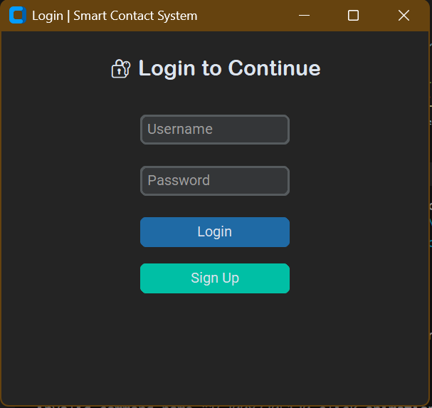
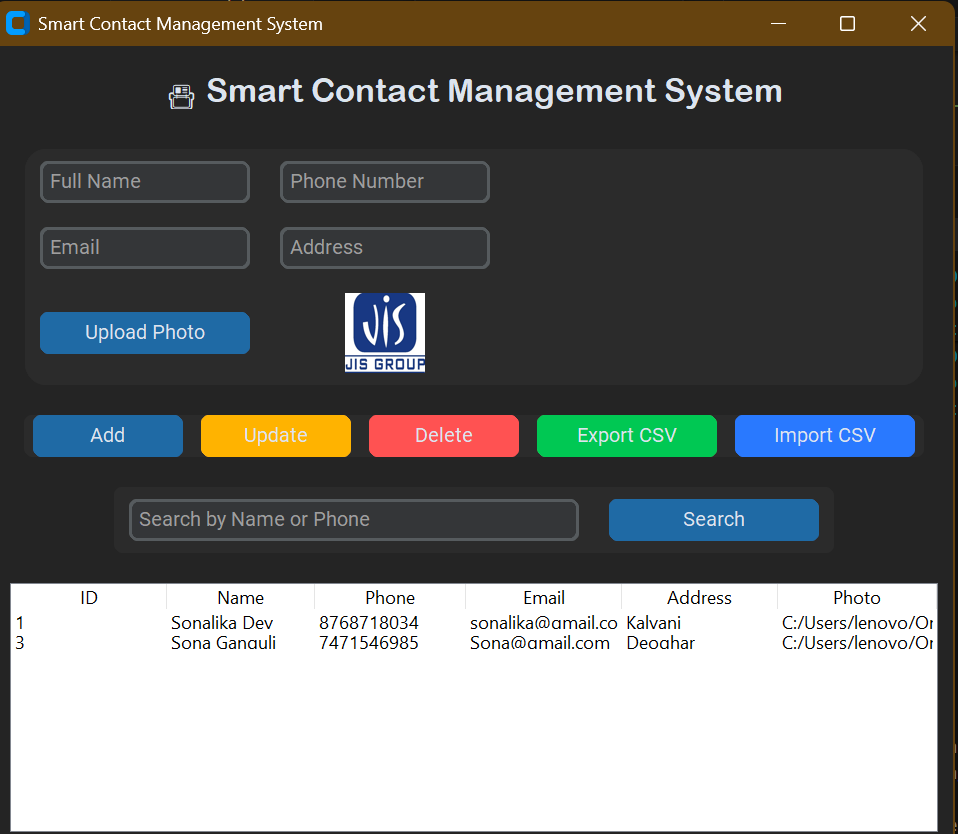

# 📇 Smart Contact Management System

The **Smart Contact Management System** is a modern, secure, and user-friendly application built with **Python (CustomTkinter)** that allows users to manage, store, and organize contacts efficiently.  
It features a **login system with bcrypt encryption**, **photo upload for each contact**, and **CSV import/export** for easy data management — all wrapped in a sleek modern interface.

---

## 🚀 Features

### 🔐 User Authentication
- Secure login & signup system using **bcrypt password hashing**
- Local SQLite storage for user credentials
- Supports multiple users (each can log in separately)

### 👤 Contact Management
- Add, update, delete, and search contacts easily
- Each contact includes:
  - Name  
  - Phone number  
  - Email  
  - Address  
  - Profile Photo (optional)
- Contacts stored permanently using **SQLite database**

### 💾 Data Import & Export
- **Export contacts** to a `.csv` file for backup or sharing  
- **Import contacts** from an existing CSV file

### 🖼️ Modern User Interface
- Built using **CustomTkinter** for a professional, responsive UI  
- Supports system-based **Dark/Light theme**
- Intuitive layout with organized sections

---

## ⚙️ Installation & Setup

### Prerequisites
Ensure you have Python 3.8+ installed.

### Step 1: Clone the Repository
```bash
git clone https://github.com/<your-username>/Smart-Contact-Management-System.git
cd Smart-Contact-Management-System
````

### Step 2: Install Dependencies

```bash
pip install customtkinter bcrypt pillow
```

### Step 3: Run the Application

```bash
python smart_contact_app.py
```

---

## 🧠 How It Works

1. **Sign Up** – Create an account with a username and password.
2. **Log In** – Enter your credentials to access the contact manager.
3. **Manage Contacts** – Add, edit, delete, or search contacts.
4. **Upload Photo** – Add a photo for better identification.
5. **Export/Import** – Save your contacts to CSV or import them anytime.

---

## 📂 Project Structure

```
Smart-Contact-Management-System/
│
├── smart_contact_app.py     # Main application file
├── contacts.db              # SQLite database (auto-created)
├── /photos/                 # (Optional) Folder for contact images
├── README.md                # Project documentation
└── requirements.txt         # Dependency list
```

---

## 📸 Screenshots (Add After Running)

| Login Page                      | Dashboard                               |
| ------------------------------- | --------------------------------------- |
|  |  |

---

## 🔮 Future Enhancements

* 🌐 Cloud sync using Firebase or MySQL
* ☁️ Multi-device access
* 🕶️ Manual Dark/Light toggle
* 🧑‍💼 Contact grouping & tagging

---

## 👨‍💻 Author

**Developed by [Snigdha Das](https://github.com/snigdhadas-cse)**
💼 Connect on [LinkedIn](https://www.linkedin.com/in/snigdhadas-cse/)

---

## 🪪 License

This project is licensed under the **MIT License** – feel free to use and modify with attribution.

---

### ⭐ If you like this project, don't forget to **star** the repo and share it!

```

